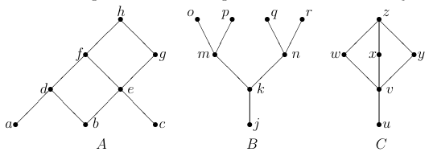
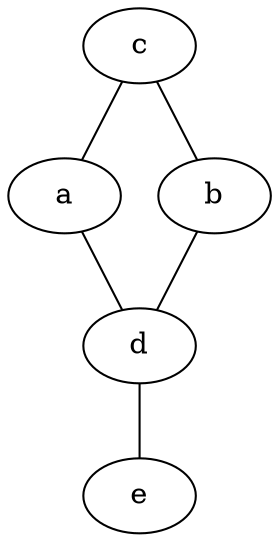
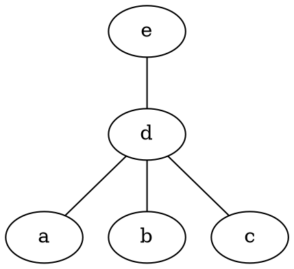
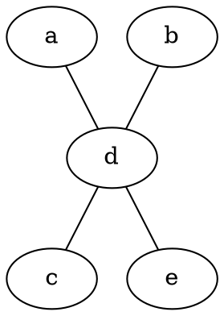
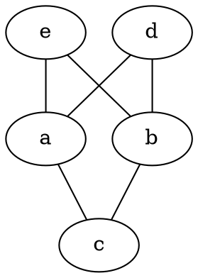
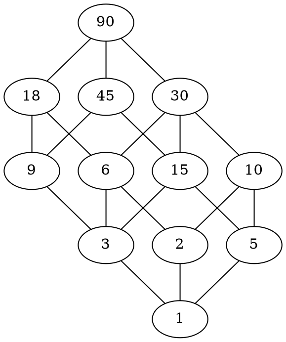

# 1
La siguiente figura muestra los diagramas de Hasse de tres conjuntos parcialmente ordenados.

## a
Para el diagrama $C$, liste tres pares que pertenezcan a la la relación $≤$, y tres pares que no pertenezcan.

$$
P_C = \{(u, v), (v, y), (y, z)\} \\
NP_C = \{(y, x), (w, x), (z, x)\} \\
$$

## b
¿Cuáles son los elementos maximales y minimales de estos conjuntos?

$$
\begin{array}{c}
M_A &=& \{h\} \\
M_B &=& \{o, p, q, r\} \\
M_C &=& \{z\} \\
\\
m_A &=& \{a, b, c\} \\
m_B &=& \{j\} \\
m_C &=& \{u\} \\ 
\end{array}
$$

## c
¿Cuáles de estos conjuntos tienen mínimo, cuáles máximo?

- Mínimo: $B$ y $C$, $j$ y $u$ respectivamente.
- Máximo: $A$ y $C$, $h$ y $z$ respectivamente.

## d
En el diagrama $A$, ¿Qué elementos cubren a $e$?

- Cubren a $e$ los elementos $f$ y $g$.

## e
Encuentre cada uno de los siguientes, si es que existe. En cada caso determine previamente el conjunto de cotas correspondiente.

$$
\begin{array}{c}
\begin{array}{c}
sup\{d, c\},& sup\{w, y, v\},& sup\{p, m\}, \\ 
inf\{a, g\},& sup\{m, n\},& inf\{g, a, f\}
\end{array}
\\ \\ \\
\begin{array}{c}
C_{d} &=& \{f, h\} \\
C_{c} &=& \{e, f, g, h\} \\
C_{\{d, c\}} &=& C_d \cap C_c \\
&=& \{f, h\} \\ \\
sup\{d, c\} &=& min(C_{\{d, c\}}) \\
&=& f \\
\\
sup\{w, y, v\} &=& min(\{z\} \cap \{z\} \cap \{w, x, y, z\}) \\
&=& z \\
\\
sup\{p, m\} &=& min(\{p\} \cap \{o, p\}) \\
&=& p \\
\\
sup\{a, g\} &=& min(\{d, f, h\} \cap \{h\}) \\
&=& h \\
\\
sup\{m, n\} &=& min(\{o, p\} \cap \{q, r\}) \\
&=& \empty \\
\\
sup\{g, a, f\} &=& min(\{h\} \cap \{d, f, h\} \cap \{h\}) \\
&=& h \\
\end{array}
\end{array}
$$

# 2
Determine la validez de las siguientes afirmaciones para un poset $(P, ≤)$:

## a
Si $P$ tiene elemento máximo $x$, entonces $x$ es el único elemento maximal.

`Verdadero`, si $x \in P$ es máximo, significa $\forall y \in P, y \le x$, es decir, todos tienen relación con $x$, luego, si existiese $x \ne y \in P$ tal que $y$ maximal, no se podría cumplir que $x \le y$ ni $y \le x$, ya que implicaría $x = y$, luego $x$ e $y$ no tienen relación, contradiciendo que $x$ sea máximo. El absurdo vino de suponer que existe otro maximal además del máximo.

> $\exist$maximo $\Rightarrow \exist$único maximal;

## b
Si $P$ es finito y tiene un único elemento maximal $x$, entonces $x$ es el máximo.

`Verdadero`, si $x \in P$ es maximal, significa $\forall y \in P, x \le y \Rightarrow x = y$, es decir, todos los elementos de $P$, o no están relacionados con $x$ o son menores o iguales. Supongamos $x \not \sim y \in P$, entonces tenemos dos casos:
1. $y$ no tiene elementos por encima, entonces los elementos de $P$ o no están relacionados con $y$ o son menores o iguales, pero eso implicaría $y$ maximal, y sabemos que $x$ es el único maximal. Por ende, no existe dicho $y$
2. $y$ tiene elementos por encima. Tomamos el elemento que esté más arriba (como $P$ finito, sabemos que existe) y aplicamos recursivamente el punto anterior hasta llegar a $y$, el cúal no tiene nada por encima y no está relacionado con $x$. Nuevamente, no puede existir dicho $y$.

Por ende, no puede existir $x \not \sim y \in P$ con $x$ único maximal. Ahora, $\forall y \in P, y \le x$, ergo, $x$ máximo
 
> $\exist$único maximal $\Rightarrow \exist$maximo;

## c∗
Si $P$ tiene infinitos elementos, y un único elemento maximal $x$, entonces $x$ es el máximo.

`Falso`, no podemos asegurar que $x$ sea máximo, ya que si nos vamos a [$2b.2$](#b-1), supongamos que esa _"rama"_ es infinita, entonces nunca vamos a terminar de encontrar el elemento que esté más arriba, por ende nunca encontraremos el maximal asociado a esa rama, y no afectaría a la unicidad de $x$, pero al no estar todos los elementos de $P$ asociados a $x$, este no puede ser máximo.

> $$
P\ finito \Rightarrow (\exist\ maximo \Leftrightarrow \exist\ único\ maximal)
> $$

# 3 
Sea $P = \{a, b, c, d, e\}$. Construya diagramas de Hasse que representen posets formados
por estos $5$ elementos, y que satisfagan:

## a
El supremo de $\{a, b\}$ es $c$, y el ínfimo es $d$. Además el ínfimo de $P$ es $e$.

## b
El supremo de $\{a, b\}$, el supremo de $\{a, c\}$ y el supremo de $\{b, c\}$ coinciden, y son todos el elemento $d$.

## c
P no tiene supremo ni ínfimo.

## d
El supremo de $\{a, b\}$ no existe puesto que $\{a, b\}$ no tienen cotas superiores.

## e
Aunque $\{a, b\}$ tiene cotas superiores, el supremo de $\{a, b\}$ no existe.

# 4
Considere el conjunto parcialmente ordenado $(D_{90}, |)$ de los divisores de $90$:

## a
Dibuje el diagrama de Hasse de la relación _“divide $a$”_.

## b
Calcule $sup\{6, 10\}$, $inf\{6, 10\}$, $sup\{30, 9\}$ e $inf\{9, 30\}$.

$$
\begin{array}{c}
\sup\{6, 10\} &=& \min(\{90, 30, 18, 6\} \cap \{90, 30, 10\}) \\
&=& \min(\{90, 30\}) \\
&=& 30 \\
\\
\inf\{6, 10\} &=& \max(\{6, 3, 2, 1\} \cap \{10, 5, 2, 1\}) \\
&=& \max(\{2, 1\}) \\
&=& 2 \\
\\
\sup\{30, 9\} &=& \min(\{90, 30\} \cap \{90, 45, 18, 9\}) \\
&=& \min(\{90\}) \\
&=& 90 \\
\\
\inf\{30, 9\} &=& \max(\{30, 15, 10, 6, 5, 3, 2, 1\} \cap \{9, 3, 1\}) \\
&=& \max(\{3, 1\}) \\
&=& 3 \\
\end{array}
$$

# 5
Determine cuáles de los siguientes mapeos de $P$ a $Q$ son isomorfismos. En caso de no serlo determine qué es lo que falla.

## a
$P = Q = \Z$ (con el orden usual), $f(x) = x + 1$.

- Es `Isomorfismo`, ya que $\forall x \in P, f(x - 1) = (x - 1) + 1 = x \in Q$, y es posible ya que $x - 1 \in P, \forall x \in \Z$.

## b
$P = Q = \Z$ (con el orden usual), $f(x) = 2x$.

- ***No*** es `Isomorfismo`, ya que por ejemplo, $1 \in P$, no existe en $Q$, ya que necesitaríamos de $\frac 1 2$ y como estamos en $\Z$, no existe.

## c
$P = Q = \Z$ (con el orden usual), $f(x) = −x$.

- Es `Isomorfismo`, ya que $\forall x \in P, f(-x) = -(-x) = x \in Q$, y es posible ya que $-x \in P, \forall x \in \Z$.

## d
$P = Q = \partial({a, b, c})$ (con la inclusión), y $f(A) = A^c$.

- Es `Isomorfismo`, ya que $\forall A \in \partial({a, b, c}), A^c \in \partial({a, b, c})$, entonces vemos que $\forall A \in P, f(A^c) = (A^c)^c = A \in Q$.
