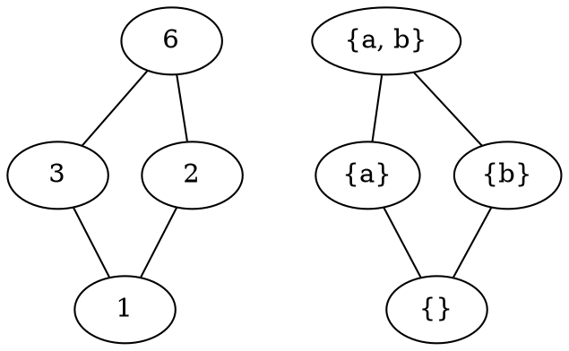
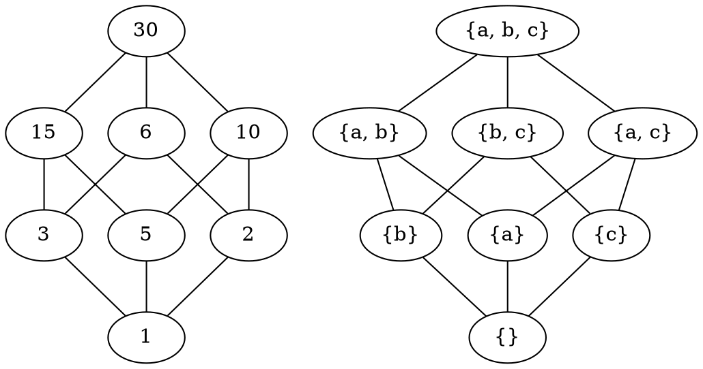
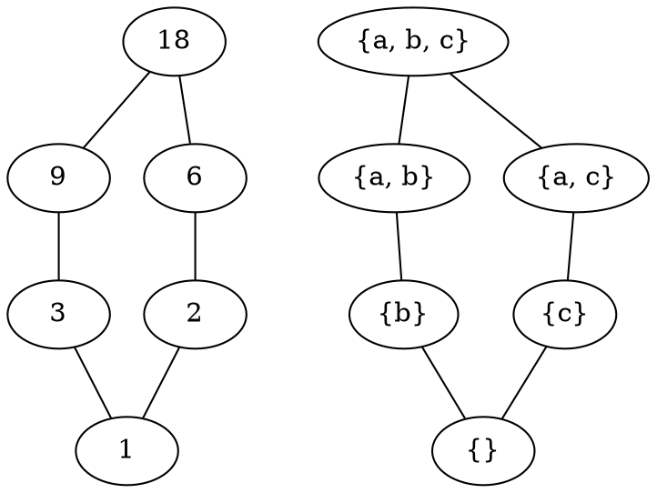
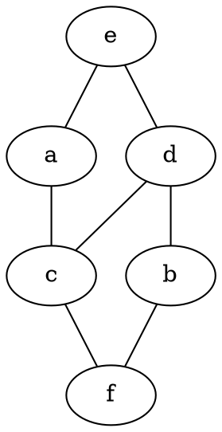
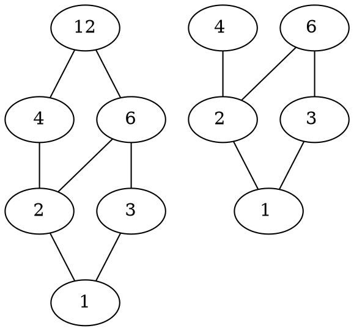
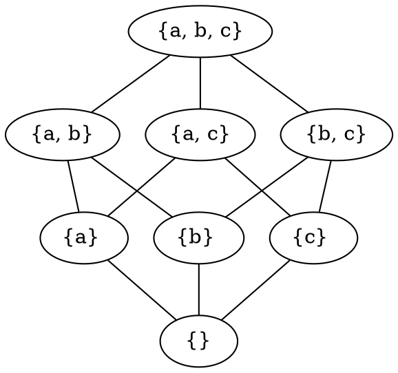
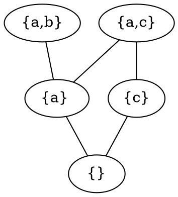

# 1
Determine si se satisfacen los siguientes isomorfismos de posets.

## a
$(D_6, |) \overset ∼= (P(\{a, b\}), ⊆)$.

> Como tienen el mismo diagrama de Hasse, son isomorfismos

## b
$(D_{30}, |) \overset ∼= (P(\{a, b, c\}), ⊆)$.

> Como tienen el mismo diagrama de Hasse, son isomorfismos

# 2
Suponga que $f : P → Q$ es un isomorfismo de posets.

> Si $m ∈ P$ es minimal, entonces $f(m)$ es minimal. Si $m ∈ P$ es maximal, entonces $f(m)$ es maximal. Probar que si $Q$ tiene algún minimal, entonces $P$ tiene un minimal $($Ayuda: usar $f^{−1})$.

- Si $m ∈ P$ es minimal, entonces significa que $m \le y, \forall y \in P$, por ende, por la definición de ismorfismo, $f(m) \le^\prime f(y), \forall y \in P$, pero como $f$ es biyectiva, tenemos que $f(m) \le^\prime x, \forall x \in Q$. Por ende, $f(m)$ es minimal en $Q$.
  - Análogamente se demuestra para $m \in P$ maximal.
- Como $f$ es biyectiva, significa que existe $f^{-1}$ isomorfismo tal que $f^{-1} : Q → P$, y aplicando lo demostrado arriba, tenemos que si $m \in Q$ minimal, entonces $f(m) \in P$ es minimal.

# 3
Determine si es posible encontrar dentro del poset $(P(\{a, b, c\}), ⊆)$ un subconjunto que visto como poset sea isomorfo a $(D_{18}, |)$.

> Como tienen el mismo diagrama de Hasse, son isomorfismos

# 4
La siguiente tabla fue llenada parcialmente. Dé los valores de $sup\{x, y\}$ para $x$ e $y$ en cierto poset $(S, ⪯)$. Por ejemplo $sup\{b, c\} = d$.

  | sup | a | b | c | d | e | f |
  | --- |---|---|---|---|---|---|
  |  a  |---| e | a | e | e | a |
  |  b  |---|---| d | d | e | b |
  |  c  |---|---|---| d | e | c |
  |  d  |---|---|---|---| e | d |
  |  e  |---|---|---|---|---| e |
  |  f  |---|---|---|---|---|---|

## a
Llene el resto de la tabla.

  | sup | a | b | c | d | e | f |
  | --- |---|---|---|---|---|---|
  |  a  | a | e | a | e | e | a |
  |  b  | e | b | d | d | e | b |
  |  c  | a | d | c | d | e | c |
  |  d  | e | d | d | d | e | d |
  |  e  | e | e | e | e | e | e |
  |  f  | a | b | c | d | e | f |

## b
¿Cuál es el mínimo y el máximo de $S$?

- El ḿaximo de $S$ es $e$ (pues no hay nadie superior a él), y el mínimo es $f$, pues solo es cota superior cuando se lo compara con sí mismo.

## c
Muestre que $f ⪯ c ⪯ d ⪯ e$.

- Vemos en la tabla que $c \land d = d$, entonces $c ⪯ d$, y tambíen sabemos que $e$ es máximo y $f$ mínimo, por ende $f ⪯ c ⪯ d ⪯ e$

## d
Dibuje el diagrama de Hasse asociado a $(S, ⪯)$.

# 5
Supongamos que un poset tiene la siguiente propiedad: para todo $a, b ∈ P, sup\{a, b\}$ existe. Pruebe que $sup(S)$ existe para cualquier $S ⊆ P$ finito y no vacío. Para esto, demuestre una fórmula que permita obtener $sup(S)$ utilizando sólamente supremos de pares. Por ejemplo, para el caso $S = \{a, b, c\}$ se puede proponer $sup(S) = sup\{sup\{a, b\}, c\}$.

> Si tomamos al poset del punto anterior como $P$, y a $S = \{f, c, b\}$, vemos que $f \land b$ no existe, y sí se cumple $\forall a, b ∈ P, \exist sup\{a, b\}$

Pero una fórmula para ver si existe dicho supremo sería:

$$
supremo(X) =
\begin{cases}
  \emptyset &,& \#X = 0 \\
  x_i &,& \#X = 1 \\
  sup(x_i, supremo(X \backslash x_i)) &,& \#X > 1 \\
\end{cases}
$$

# 6
## a
Dibuje los diagramas de Hasse de los posets $A = (\{1, 2, 3, 4, 6, 12\}, |)$ y $B = (\{1, 2, 3, 4, 6\}, |)$.

## b
Determine cuándo están definidas las operaciones $∧, ∨$ en esos posets.

> En $A$ están definidas para todo el poset, y en $B$, $\land$ está definida para todo el poset, pero $\lor$ no está definida para $4$ y los elementos no relacionados con él.

## c
¿Cuáles de esos posets son reticulados?

> $A$ es reticulado, pero $B$ no lo es, ya que $4 \lor 6$ y $4 \lor 3$ no existen.

## d
Calcular $4 ∧ (2 ∨ 3)$ en ambos posets.

$$
\begin{gather*}
  &A& \\
  4 \land (2 \lor 3) &=& 4 \land 6 \\
  &=& 2 \\
\\
  &B& \\
  4 \land (2 \lor 3) &=& 4 \land 6 \\
  &=& 2 \\
\end{gather*}
$$

## e
Determinar un subconjunto de $(P(\{a, b, c\}), ⊆)$ cuyo diagrama de Hasse sea $B$.

# 7
Demuestre que en todo poset reticulado se cumple $x ∨ (y ∧ z) ≤ (x ∨ y) ∧ (x ∨ z)$.

- Para demostrar $x \lor (y \land z) ≤ (x \lor y) \land (x \lor z)$, tenemos que demostrar

$$
\begin{gather*}
x ≤ (x \lor y) \land (x \lor z) \\
(y \land z) ≤ (x \lor y) \land (x \lor z) \\
\end{gather*}
$$

Y subdividimos $x ≤ (x \lor y) \land (x \lor z)$ en

$$
\begin{gather*}
x ≤ (x \lor y) \land (x \lor z) ≤ (x \lor y) \\
x ≤ (x \lor y) \\
\\
x ≤ (x \lor y) \land (x \lor z) ≤ (x \lor z) \\
x ≤ (x \lor z)
\end{gather*}
$$

los cuales sabemos que son ciertos por la definición de cota superior, por ende $(x \lor y) \land (x \lor z) ≤ (x \lor y)$ es cota superior de $x$.

Subdividimos ahora $(y \land z) ≤ (x \lor y) \land (x \lor z)$ en

$$
\begin{gather*}
y \land z ≤ (x \lor y) \land (x \lor z) ≤ (x \lor y) \\
y \land z ≤ x \lor y \\
y \land z ≤ y ≤ x \lor y \\
\\
y \land z ≤ (x \lor y) \land (x \lor z) ≤ (x \lor z) \\
y \land z ≤ x \lor z \\
y \land z ≤ z ≤ x \lor z \\
\end{gather*}
$$

por transitividad, las ultimas desigualdades son correctas, por ende $(y \land z) ≤ (x \lor y) \land (x \lor z)$ es válido, y por ende $x \lor (y \land z) ≤ (x \lor y) \land (x \lor z)$ también lo es.

# 8∗
Determine cuántos isomorfismos hay de $(P(\{a, b, c\}), ⊆)$ en sí mismo.

- Tenemos la identidad,
- las permutaciones de $a, b, c$ (las de sus cotas no las contamos, porque se moverían junto con ellos para mantener la relación de $⊆$).

> Un total de 4 isomorfismos.
