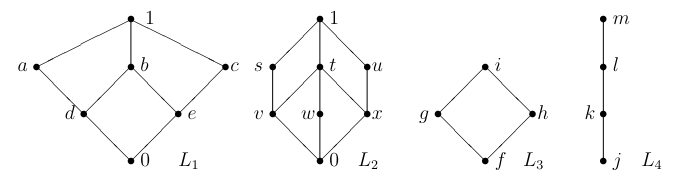

  

# 1
Considere el reticulado $L_2$. Encuentre $v ∨ x, s ∨ v$ y $u ∨ v$.

$$
\begin{gather*}
  v \lor x &=& t \\
\\
  s \lor v &=& s \\
\\
  u \lor v &=& 1 \\
\end{gather*}
$$

# 2
En el reticulado $L_1$, muestre todas las formas posibles de escribir los elementos $1, b$ y $c$ como supremo de dos elementos. Por ejemplo, una manera sería $1 = d ∨ c$. Considerar las formas no triviales, es decir, descartamos por ejemplo $1 = 1 ∨ b$.

$$
\begin{gather*}
  1 &=& a \lor b &=& a \lor c &=& b \lor c &=& a \lor e &=& c \lor d \\
\\
  b &=& d \lor e &=& d \lor b &=& e \lor b &=& d \lor b &=& 0 \lor b \\
\\
  c &=& e \lor c &=& 0 \lor c \\
\end{gather*}
$$

# 3
## a
Defina una función $f$ biyectiva del reticulado $L_3$ en el reticulado $L_4$ que preserve el orden, es decir, tal que $x ≤ y \Rightarrow f(x) ≤^′ f (y)$.

$$
fun(x) =
\begin{cases}
  m &,& x = i \\
  l &,& x = h \\
  k &,& x = g \\
  j &,& x = f \\
\end{cases}
$$

## b
Compruebe que no se cumple $x ≤ y \Leftarrow f (x) ≤^′ f (y)$. La función $f$ es un ejemplo que muestra que preservación del orden no implica isomorfismo.

> Vemos que si tomamos $x = g$, se cumple $fun(g) ≤^′ fun(y), \forall y \in \{g, i\}$, pero también tenemos $fun(g) ≤^′ fun(h)$, lo cuál no es cierto para $x ≤ y \Leftarrow f (x) ≤^′ f (y)$.

## c
Pruebe también que $f$ no preserva supremo ni ínfimo.

> Siguiendo el ejemplo anterior, $g \lor h = i$, pero tenemos también que $fun(g) \lor fun(h) = l \ne m = fun(i)$.

# 4
Revise en el teórico qué condiciones se deben cumplir para que:

## a
un subconjunto $S ⊆ L$ sea subreticulo del retículo $L$

> $(S, ∨, ∧)$ es un subreticulado de $(L, ∨, ∧)$ si es cerrado por las operaciones $∨$ y $∧$.

## b
un reticulo cualquiera $M$ se incruste en el retículo $L$

> $M$ se incrusta en el retículo $L$ si y solo si existe un subreticulado $S ⊆ L$ y un isomorfismo $f : M → S$ , la incrustación de $M$ en $L$.

## Extra
Luego responda: Para qué valores $n$ se tiene que $D_n$ se incrusta en $L_1$?

> Para todos los $n$ primos, potencias de primos (hasta el cubo inclusive), y productos de 2 primos.

# 5
Decida, y fundamente, cuáles de los reticulados $L_1, L_2, L_3$ y $L_4$ son complementados.

- $L_1$ no es complementado, ya que para $b$ no tiene complemento.
- $L_2$ no es complementado, ya que para $t$ no tiene complemento.
- $L_4$ no es complementado, ya que para $k$ no tiene complemento.
- $L_3$ es complementado, y los complementos son $\{(i, f), (g, h)\}$.

# 6
¿Tiene todo reticulado finito primer y último elemento?

- Teniendo un poset reticulado $A$ de $n$ elementos, nombramos a los elementos de $A$ como $a_1, a_2, \dots, a_n$, luego la función definida en la [guía 3](guia-03.md#5) nos encontraría los supremos de pares supremos a otros pares, hasta encontrar el supremo de todos los pares, y como es único y es mayor o igual a todos los otros elementos de $A$, es el máximo, o sea, el último elemento.
- De forma análoga se demuestra la existencia del primer elemento.

> La existencia de dichos elementos nos la garantiza que sea reticulado, ya que existen los supremos y los infimos para todo par de elementos de $A$. De no existir un último elemento, existirían dos maximales, pero se sabe que dos maximales nunca van a tener un supremo, por ende no sería reticulado. El absurdo provino de asumir que un poset reticulado finito no tendría un último elemento.

# 7
Supongamos que un poset tiene la siguiente propiedad: para todo subconjunto $S$ de $P$ se tiene que $sup(S)$ existe $($en particular existe $sup(P)$ y $sup(∅))$. Demostrar que $inf(S)$ existe para cualquier $S$.

Para que se cumpla que para todo subconjunto $S$ de $P$ existe $sup(S)$, se necesita que:
- Todo elemento de $P$ no tenga dos cotas superiores distintas, no relacionadas 
  - ya que bastaría con tomar un subconjunto que incluya hasta dichas cotas y entonces no existiría el supremo. 
- Tampoco puede tener dos cotas inferiores distintas, no relacionadas
  - ya que se podrían tomar sus dos cotas inferiores únicamente, teniendo dos elementos disjuntos y aislados, por ende su suprema no existe.

Por ende $P$ tiene un diagrama de $Hasse$ con forma de línea recta. Sabemos que $P$ está acotado inferiormente por existir $sup(∅)$, por ende, todo subconjunto $S$ va a tener elementos mayores iguales a dicha cota, y como $S$ es una línea recta, tiene ínfimo.
