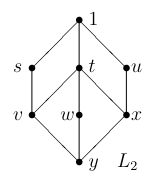
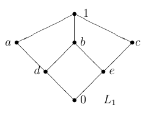
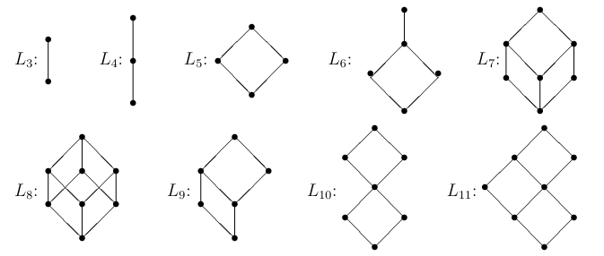
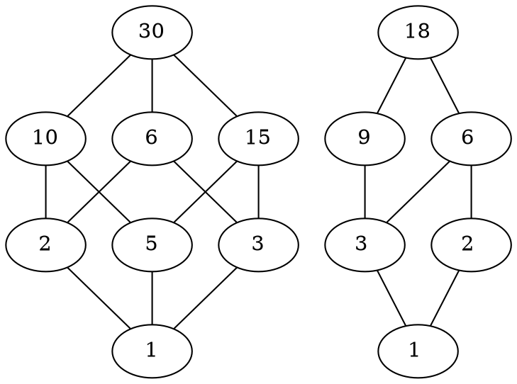
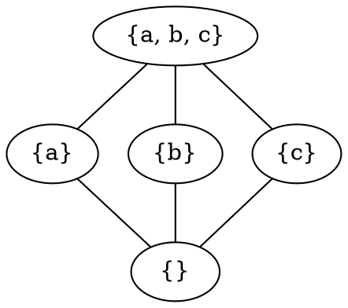

# 1
Considere el reticulado $L_2$ de la siguiente figura.

  

## a
¿Es $L_2$ un reticulado complementado?

> $t$ no tiene complemento, por ende no, $L_2$ no es complementado.

## b
Encuentre un elemento con dos complementos.

> $s$ tiene de complementos a $x$ y $u$.

## c
¿Es $L_2$ un reticulado distributivo?

> $s \in L_2$ tiene como complementos a $u$ y $x$, por ende, al tener dos complementos, no es distributivo.

# 2

  

## a
Dé los complementos, si es que existen, de los siguientes elementos: $a, b, d, 0$.

- De $a$ son $\{c, e\}$.
- $b$ no tiene complementos.
- De $d$ es $c$.
- De $0$ es $1$.

## b
¿Es $L_1$ un reticulado complementado?

> No, ya que $b$ no tiene complemento.

## c
¿Es $L_1$ un reticulado distributivo?

> No, ya que $a \in L_1$ tiene dos complementos.

# 3
Considere los siguientes diagramas.

  

## a
Determine cuáles son isomorfos a algún $D_n$.

- $L_3$ a $D_2$.
- $L_4$ a $D_9$.
- $L_5$ a $D_6$.
- $L_8$ a $D_{30}$.
- $L_9$ a $D_{20}$.

## b
Determine cuáles se incrustan en $P(X)$ para algún conjunto $X$.

- $L_3$ a $P(\{a\})$.
- $L_4$ a $P(\{a. b\})$.
- $L_5$ a $P(\{a. b\})$.
- $L_6$ a $P(\{a. b, c\})$.
- $L_8$ a $P(\{a. b, c\})$.
- $L_9$ a $P(\{a. b, c\})$.
- $L_{10}$ a $P(\{a. b, c, d\})$.
- $L_{11}$ a $P(\{a. b, c, d\})$.

## c
Determine cuáles son reticulados distributivos.

- $L_3$
- $L_4$
- $L_5$
- $L_6$
- $L_{10}$

# 4
Determine si los poset reticulados $(D_{18}, |)$ y $(D_{30}, |)$ son complementados y/o distributivos.

- $D_{30}$ es complementado $(2, 15), (3, 10), (5, 6), (30, 1)$, $D_{18}$ no es complementado ya que $3$ y $6$ no tienen complementos.
- Todos los $D_n$ son distributivos.

# 5
Dar el diagrama de Hasse de un reticulado no distributivo donde todo elemento tenga a lo sumo un complemento.

# 6
Enumere todos los métodos que utilizó en los ejercicios anteriores para determinar si un reticulado era o no distributivo. Es importante también identificar los resultados teóricos que están implicados en cada método.

- Se le puede incrustar $N_5$ o $M_3$.
- Tiene algún elemento con $2$ o más complementos.

# 7
Sea $S$ un reticulado.

## a
Demuestre que si $x ≤ y$, entonces para todo $z$ en $S, x ∨ (z ∧ y) ≤ (x ∨ z) ∧ y$.

$$
\begin{gather*}
  y \le (z \lor y)  \\
  (x \lor z) \le x \\
  (x \lor z) ∨ y \le (x \lor z) ∨ (z ∧ y) \le x ∨ (z ∧ y) 
\end{gather*}
$$

## b
Compruebe que si $S$ es distributivo vale la igualdad.

$$
\begin{gather*}
  x ∨ (z ∧ y) &=& (x ∨ z) ∧ (x ∨ y) \\
  &\le& (x ∨ z) ∧ y
\end{gather*}
$$

## c
Si en un reticulado vale la igualdad para todo $x ≤ y$, ¿es distributivo?

# 8
Demostrar que $M_3$ y $N_5$ no son distributivos usando la propiedad cancelativa.

# 9
Demostrar que si un reticulado satisface la propiedad cancelativa, entonces es distributivo. (Ayuda: usar el Teorema M3-N5).

